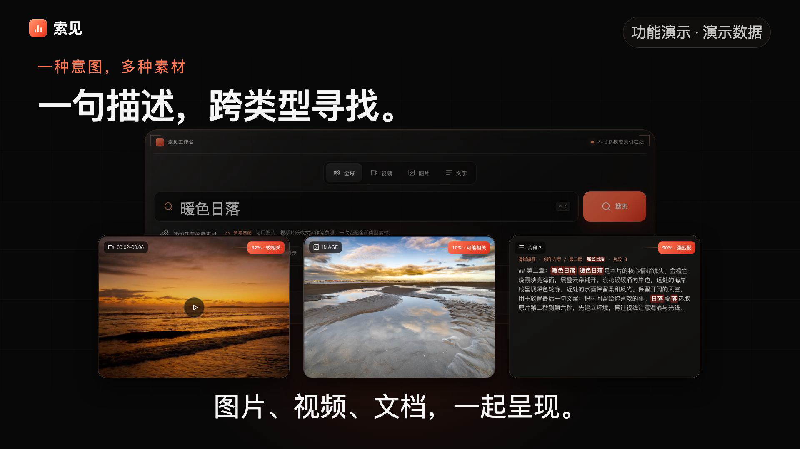
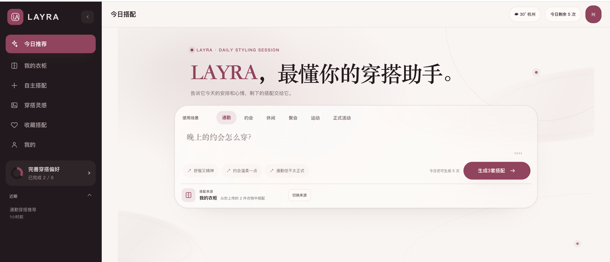
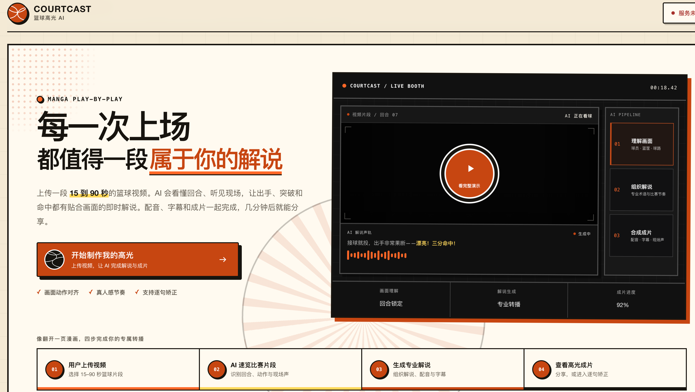

<picture>
  <source media="(max-width: 600px)" srcset="./assets/header-mobile.svg">
  
</picture>

  <a href="https://zhouchengjian-user.github.io/personal-homepage/"><strong>个人作品集 ↗</strong></a> &nbsp; · &nbsp;
  <a href="#代表作品">代表作品</a> &nbsp; · &nbsp;
  <a href="mailto:1131832604@qq.com">联系我</a>

我是 **周承健，AI 产品经理 / 独立开发者**。关注多模态检索、AI 内容生产与实时交互，用可体验的产品验证想法，持续打磨准确性、效率和使用体验。

## 代表作品

### 索见 · 多模态素材检索平台

**海量内容，一搜即见。** 面向短剧、短视频与设计团队，让素材查找从“翻文件”变成“找镜头、找画面、找段落”。

[▶ 观看 40 秒演示](https://github.com/Zhouchengjian-user/Zhouchengjian-user/blob/main/assets/suojian-demo.mp4)

- **产品设计**：统一文字、参考图和视频片段搜索入口，视频按镜头返回，文档按命中段落展示上下文。
- **能力落地**：融合 WeMM 语义向量、语音转写与 OCR，让画面和文字都参与检索。
- **体验迭代**：围绕长视频分块处理、失败续跑、进度可见和命中片段播放持续优化。

演示使用真实产品界面与示例数据，不代表速度或准确率实测；人物参考匹配不等于身份识别。项目持续迭代中。

### LAYRA · AI 衣柜与穿搭助手

把“今天穿什么”变成可执行的搭配建议：从拍照录入衣物、管理衣柜，到按场景推荐与试穿，串联完整使用流程。

<strong>展开 LAYRA 界面与设计重点</strong>

 

关注衣物识别后的信息组织、场景输入的引导方式，以及推荐结果到试穿的体验衔接。界面截图为阶段版本，最新功能以项目说明为准。

[查看项目](https://github.com/Zhouchengjian-user/Layra-Outfit-Assistant) · [观看演示](https://zhouchengjian-user.github.io/Layra-Outfit-Assistant/demo/?v=20260906)

### CourtCast · 篮球视频 AI 解说

上传篮球片段，生成中文逐球解说、配音、字幕与视频成片。支持逐句修改、重新生成，让人能校正 AI 输出。

<strong>展开 CourtCast 界面与设计重点</strong>

 

聚焦音视频理解、解说事实约束和可编辑交付。当前面向 15–90 秒片段，不把完整比赛自动剪辑作为已完成能力；截图中的进度为界面展示，不是性能指标。

[查看项目](https://github.com/Zhouchengjian-user/basketball-highlight-ai) · [观看演示](https://github.com/Zhouchengjian-user/basketball-highlight-ai/blob/main/docs/media/courtcast-demo.mp4)

更多探索：[实时语音展厅原型](https://github.com/Zhouchengjian-user/construction-lobby-digital-human)，研究流式对话、插话打断与知识边界。

## 我如何做 AI 产品

**发现问题 → 设计流程 → 验证能力 → 做出产品 → 评估迭代**

- **需求与体验**：拆解高频任务，明确用户需要的结果与交互路径。
- **模型与系统**：围绕 RAG、多模态、语音与工作流，权衡效果、延迟、成本和能力边界。
- **交付与验证**：用原型、代码和演示推进落地，让失败可解释、结果可纠正、效果可评估。

欢迎交流 AI 产品、内容工具与从零到一的实践。

[个人作品集 ↗](https://zhouchengjian-user.github.io/personal-homepage/) · [邮件联系](mailto:1131832604@qq.com)

本页产品画面来自我的项目。素材与演示说明见 [素材来源](./ASSETS.md)。
